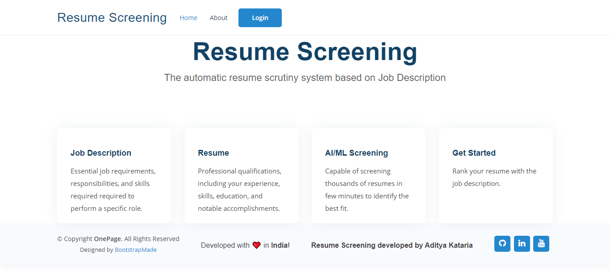
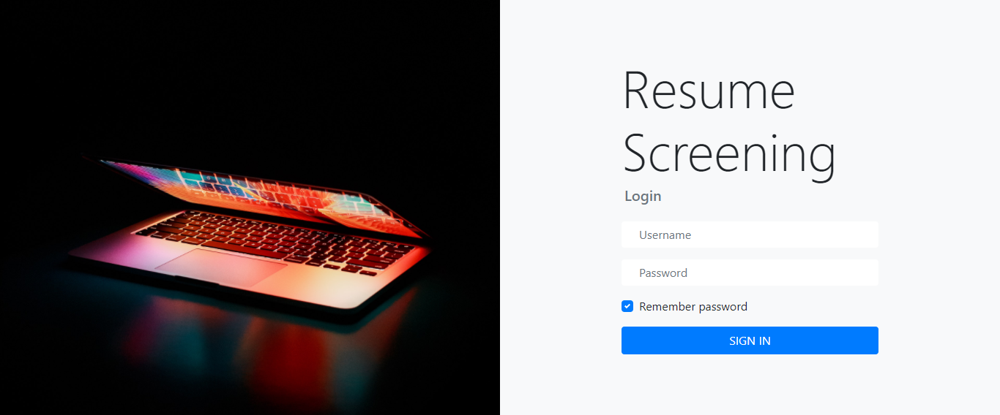
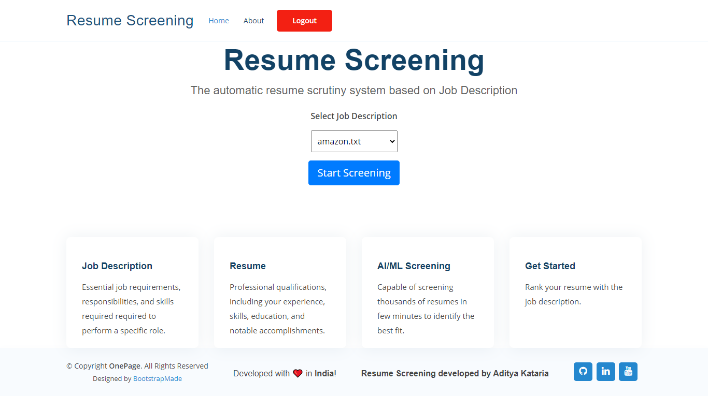
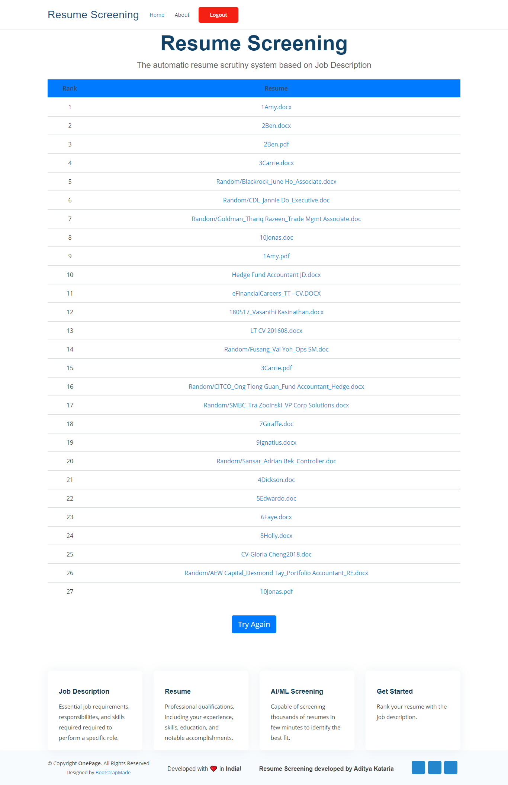

# Resume_Screening
The automatic resume scrutiny system based on job description

# Introduction
Finding suitable candidates for an open role could be a daunting task, especially when there are many applicants. It can impede team progress for getting the right person on the right time. An automated way of “Resume Screening and Ranking” could really ease the tedious process of fair screening and shortlisting, it would certainly expedite the candidate selection and decisionmaking process.

## Resume Screening
Resume screening is still the most time-consuming part of recruiting: screening resumes is estimated to take up to 23 hours for just one hire.
When a job opening receives 250 resumes on average and 75% to 88% of them are unqualified, it’s no wonder the majority of talent acquisition leaders still find the hardest part of recruitment is screening the right candidates from a large applicant pool.

Resume screening is the process of determining whether a candidate is qualified for a role based his or her education, experience, and other information captured on their resume.

In a nutshell, it’s a form of pattern matching between a job’s requirements and the qualifications of a candidate based on their resume.
The goal of screening resumes is to decide whether to move a candidate forward – usually onto an interview – or to reject them.

### <b>Automation helps solve the two major challenges recruiters experience with resume screening: Volume and Quality of Hire.</b>

### Volume
AI for resume screening can handle massive volumes of data. In fact, AI requires a lot of data in order to make accurate recommendations about which candidates to move forward to the next stage.<br>
This means AI screening software is most valuable for high volume recruitment such as retail sales or customer service roles.<br>
The time you save screening resumes can be used in more valuable ways, whether it’s sourcing, engaging, or interviewing candidates to help determine how well they’ll fit in the job and company culture.

### Quality of hire
Automated resume screening increases quality of hire by reducing false positives because candidates can’t trick the ATS through keyword stuffing. It also reduces false negatives because candidates with good qualifications no longer slip through the keyword filters.<br>

# File Structure

```
Resume_Screening
|_ Extra_Resumes
   |_ Directories of extra resumes
|_ Job_Description
   |_ Job Description files in .txt, .pdf, .doc formats
|_ Original_Resumes
   |_ Directories and files of used resumes in .pdf, .doc formats
|_ static
   |_ analytics.js
|_ templates
   |_ assets
   |_ index.html
   |_ login.html
   |_ result.html
|_ app.py
|_ contentfilter.py
|_ pdf_to_text.py
|_ screen.py
|_ text_process.py
```

# Webpages
#### Home Page
</img>

#### Login Page
</img>

#### Select Job Description and start Screening Page
</img>

#### Result Page
</img>

# Conclusion
The main feature of the current project is that it searches the entire resume database to select and display the resumes which fit the best for the provided job description(JD). This is, in its current form, achieved by assigning a score to each CV by intelligently comparing them against the corresponding Job Description.
